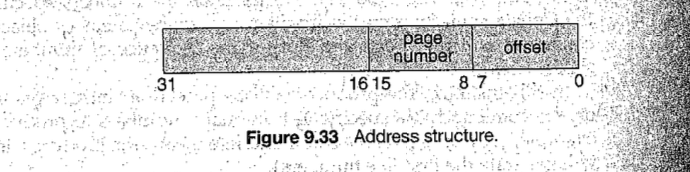
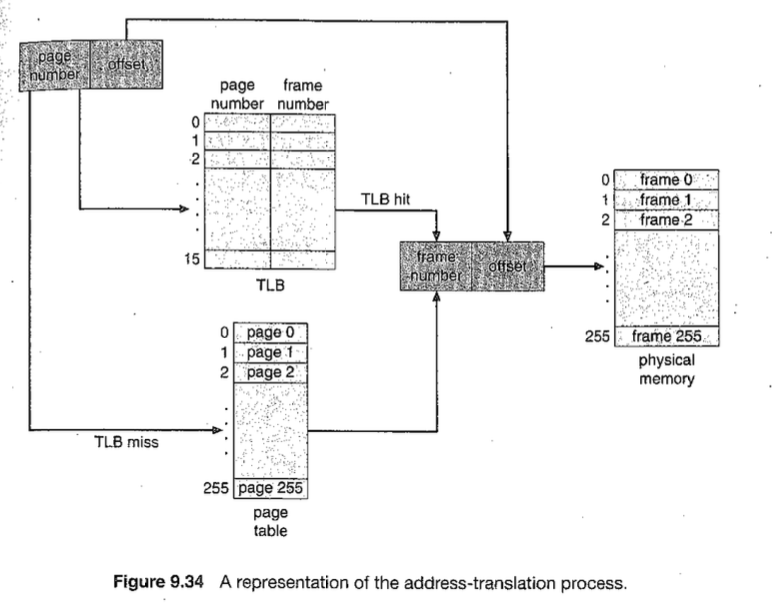

# Virtual Memory Manager

This project consists of writing aprogram that translates logical ot physical addresses for a virtual address space of size 216 =65,536 bytes. Your program wil read from afile containing logical addresses and, using aTLB as wel as apage table, wil translate each logical address to its corresponding physical address and output the value of the byte stored at the translated physical address. The goal behind this project si to simulate the steps involved in translating logical ot physical addresses.

## Specifics

Your program will read a file containing several 32-bit integer numbers that represent logical addresses. However, you need only be concerned with 16-bit addresses, so you must mask the rightmost 16 bits of each logical address. These 16 bits are divided into (1) an 8-bit page number and (2) 8-bit page offset, Hence, the addresses are structured as shown in Figure 9.33.
Other specifics include the following:

## Specifications

- **Page Table Entries**: 2^8 entries
- **Page Size**: 256 bytes (2^8 bytes)
- **TLB Entries**: 16 entries
- **Frame Size**: 256 bytes (2^8 bytes)
- **Physical Memory**: 65,536 bytes (256 frames x 256-byte frame size)
- **Backing Store**: A binary file named `BACKING_STORE.bin` of size 65,536 bytes

Additionally, your program need only be concerned with reading logical addresses and translating them ot their corresponding physical addresses You do not need to support writing ot the logical address space

## Address Translation Process

Your program will translate logical to physical addresses using a TIB and page table as outlined in Section 8.5. First, the page number is extracted from the logical address, and the TLB is consulted. In the case of a TLB-hit, theframe number is obtained from the TLB. In the case of a TLB-miss, the page table must be consulted. In the latter case, either the frame number is obtained




from the page table or a page fault occurs. A visual representation of the address-translation process appears ni Figure 9.34.


1. **Extract Page Number and Offset**: The 16-bit logical address is divided into an 8-bit page number and an 8-bit page offset.
2. **TLB Consultation**: 
   - **TLB Hit**: The frame number is obtained from the TLB.
   - **TLB Miss**: The page table is consulted.
     - **Page Table Hit**: The frame number is obtained from the page table.
     - **Page Fault**: The page is loaded from the `BACKING_STORE.bin` into an available page frame in physical memory, and the page table and TLB are updated.

## Handling Page Faults

Your program will implement demand paging as described ni Section 9.2. The backing store si represented by the file BACKING_STORE. bin, abinary file of size 65,536 bytes. When apage fault occurs, you will read in a256-byte page from the fiel BACKING_STORE and store ti ni an available page frame in physical memory. For example, if a logical address with page number 15 resulted in a page fault, your program would read in page 15 from BACKING_STORE (remember that
pages begin at 0 and are 256 bytes in size) and store it in a page frame in physical memory. Once this frame is stored (and the page table and TLB are
updated), subsequent accesses ot page 15 wil be resolved by either the TIB or the page table.
You will need to treat BACKING STORE. bin as a random-access file so that
you can randomly seek to certain positions of the file for reading. We suggest using the standard Clibrary functions for performing 1/0, including fopen (), fread (), fseek (), and fclose ().
The size of physical memory is the same as the size of thevirtual address space—65,536 bytes—so you do not need to be concerned about page replacements during a page fault. Later, we describe a modification to this project using a smaller amount of physical memory; at that point, a page-replacement strategy will be required.

When a page fault occurs, the program reads a 256-byte page from the `BACKING_STORE.bin` file and stores it in an available page frame in physical memory. The program uses demand paging, and there is no need for a page-replacement strategy since physical memory size matches the virtual address space size.

## Input File

- **addresses.txt**: A file containing 1,000 32-bit integer values representing logical addresses ranging from 0 to 65,535. The program reads this file, translates each logical address to a physical address, and outputs the value of the signed byte stored at the physical address.

## Output

For each logical address, the program will output:
1. The logical address being translated.
2. The corresponding physical address.
3. The signed byte value stored at the translated physical address.

## Statistics

After the completion of the translation, the program reports the following statistics:
- **Page-fault rate**: The percentage of address references that resulted in page faults.
- **TLB hit rate**: The percentage of address references resolved using the TLB.

## Modifications

In practice, physical memory is typically smaller than the virtual address space. As a modification, you can adjust the program to use 128 page frames instead of 256, requiring the implementation of a page-replacement policy using either FIFO or LRU.

## How to Run

Compile and run the program as follows:

```bash
gcc -o vm_manager vm_manager.c
./vm_manager addresses.txt
```

### Files Provided

- **addresses.txt**: Contains the logical addresses to be translated.
- **BACKING_STORE.bin**: The binary file representing the backing store.
- **correct.txt**: A file containing the correct output values for the file `addresses.txt`.

### Example

For an input logical address of `1`:
- Logical Address: 1
- Physical Address: [Translated Address]
- Signed Byte Value: [Byte Value]

## License

This project is licensed under the MIT License.
